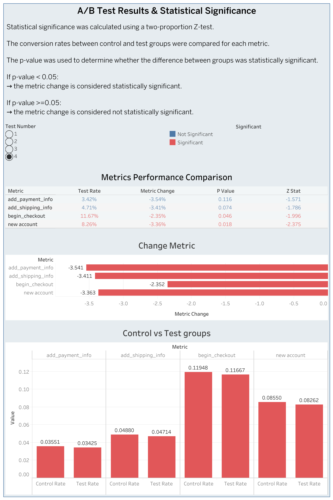

# A/B Testing Significance Dashboard

## Project Overview

This project extends an A/B testing dashboard by adding statistical significance analysis calculated with Python.

The goal was to replace manual online calculators with an automated Python workflow and visualize the results in Tableau.

## Tools Used

- Python
- Pandas
- NumPy
- Statsmodels
- Google Colab
- Tableau Public

## Key Metrics

Statistical significance was calculated for four funnel metrics:

- add_payment_info / session
- add_shipping_info / session
- begin_checkout / session
- new_accounts / session

## Methodology

For each test and metric, conversion rates were calculated for the control and test groups.

The statistical significance was calculated using a two-proportion Z-test.

If p-value < 0.05, the result was marked as statistically significant.

## Output

The final CSV file contains:

- test number
- metric name
- control group conversion rate
- test group conversion rate
- metric change
- z-statistic
- p-value
- significance flag

## Tableau Dashboard

[View Tableau Dashboard](Tableau_Public link)

## Dashboard Preview

## Project Result

The final dashboard allows users to:

- select a specific A/B test
- compare control and test group conversion rates
- analyze metric changes
- identify statistically significant results
- understand the Python logic used for significance calculation
